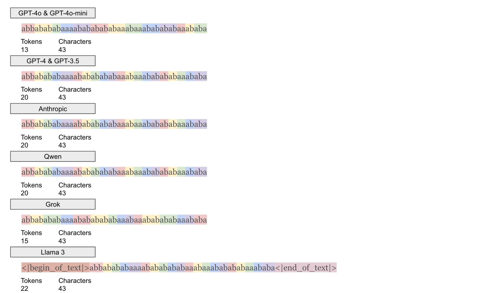
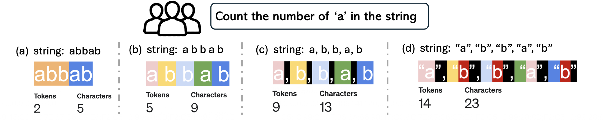

# Counting Conundrum: Interplay of Tokenization and Chain of Thought in Inductive Reasoning

This project investigates the impact of tokenization on the inductive counting tasks performed by large language models.  Tokenization, the process of converting a sequence of characters into tokens, can significantly affect how well models perform on tasks requiring the counting of characters or tokens. Different large language models may use different tokenization methods, which can affect their performance on counting tasks.



## Counting Example

The following example demonstrates how various tokenization approaches can impact the character counting (e.g., counting the number of 'a's) in a simple string.

### The String Variations

- **(a) Original String**: `abbab`
- **(b) Spaced String**: `a b b a b`
- **(c) Comma-separated String**: `a, b, b, a, b`
- **(d) Quoted String**: `"a", "b", "b", "a", "b"`

Each string produces a different number of tokens and characters, which impacts the model's ability to count accurately.

### Tokenization and Character Count

- **(a) Original String**: 5 characters, 2 tokens
- **(b) Spaced String**: 9 characters, 5 tokens
- **(c) Comma-separated String**: 13 characters, 9 tokens
- **(d) Quoted String**: 23 characters, 14 tokens

The figure below illustrates these examples with tokenization details.



## Examples of Running Experiments

```bash
# Run an experiment with a newly generated dataset
# -n: Number of examples (e.g., 1000)
# -l: Minimum sequence length (e.g., 20)
# -u: Maximum sequence length (e.g., 30)
# -t: The letter set (e.g., "ab" for constructing a dataset with "a" and "b")
# -c: The target character to count (e.g., "a")
# -e: The experiment version or type (e.g., 1 for original string)
# -a: The agent to use (e.g., "claude" for Anthropic)
python -m counting.count_experiment -n 1000 -l 20 -u 30 -t "ab" -c "a" -e 1 -a "claude"

# Run an experiment using an existing dataset with supervised chain-of-thought
# -d: Path to the existing dataset
# -c: The target character to count (e.g., "a")
# -e: The experiment type (e.g., 3 for Quoted String)
# -s: Enables supervised chain-of-thought
python -m counting.count_experiment -d "path_to_dataset" -c "a" -e 3 -s

```

### Experiment Number Correspondence to Tokenization

- **(a) Original String**: `-e 1`
- **(b) Spaced String**: `-e 4`
- **(c) Comma-separated String**: `-e 2`
- **(d) Quoted String**: `-e 3`

## Examples of Evaluating Experiment Results

```bash
# Evaluate experiment results
# -d: Path to the dataset used for the experiment
# -p: Path to the result file to be evaluated
# -c: The target character that was counted (e.g., "a")
python -m counting.evaluate -d "path_to_dataset" -p "path_to_result_file" -c "a"
```
